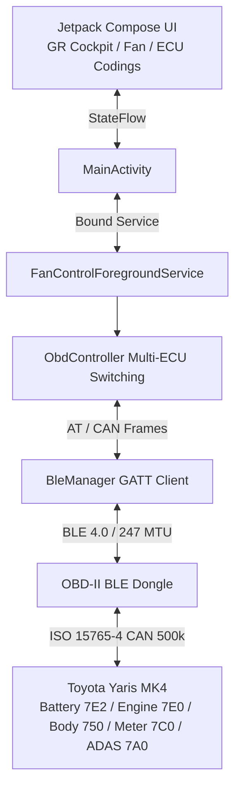

# Toyota Yaris MK4 Hybrid - HV Battery Cooling, GR Cockpit & ECU Coding Suite 🏎️⚡

[](https://francescocastaldi.github.io/yaris-hv-fan-optimizer/)
[-D71920.svg?style=for-the-badge&logo=android)](https://francescocastaldi.github.io/yaris-hv-fan-optimizer/YarisHvFanControl-v2.9.15.apk)
[-3DDC84.svg?style=flat&logo=android)](https://www.android.com/)
[](https://kotlinlang.org/)
[](https://developer.android.com/jetpack/compose)
[](https://github.com/FrancescoCastaldi/yaris-hv-fan-optimizer)
[-00E676.svg?style=flat&logo=letsencrypt)](yaris_release.keystore)
[](LICENSE)

Applicazione Android nativa ad altissime prestazioni per **Toyota Yaris MK4 Hybrid (Piattaforma XP210 / TNGA-B, MY2020 - MY2025+)**. Interagisce via Bluetooth Low Energy (BLE) o Bluetooth Classic SPP con l'infrastruttura CAN bus dell'auto per offrire:
1. **Handshake Avanzato Intelligente Stile Hybrid Assistant & Dr. Prius (v2.9.6+)**:
   - Sequenza preventiva di risveglio `\r\r` per svegliare Vgate iCar Pro da sleep/low-power standby;
   - Warm Start / Reset (`AT WS` / `AT Z`) con attesa dedicata a 600ms senza bloccare il baudrate;
   - Rilevamento robusto dello stato READY auto tramite tensione reale batteria 12V (`AT RV >= 13.0V` convertitore DC-DC attivo) immune a banner di versione firmware, con sincronizzazione periodica via probe frame CAN;
   - Modalità Standby a basso consumo quando l'auto è spenta o non READY, azzerando le richieste CAN e prevenendo saturazione bus, errori `NO DATA` e scarica della batteria 12V;
2. **Flow Control Hardware ISO-TP Denso Multi-Frame (PID 2228C1)**:
   - Configurazione hardware dinamica del chip ELM/STN (`AT CRA 7EA`, `AT FC SH 7E2`, `AT FC SD 300000`, `AT FC SM 1`) con timeout calibrato a ~819ms (`AT ST C8`, v2.9.14) per dare margine sufficiente ai cloni ELM327/Vlinker sulle risposte multi-frame delle celle batteria HV e ventola;
3. **Watchdog di Riconnessione Silenziosa & Auto-Connect Istantaneo all'Avvio**:
   - Closed-loop watchdog con backoff esponenziale automatico e socket streaming thread-safe, senza dialog bloccanti o fastidiosi in caso di disconnessione o spegnimento vettura;
   - Connessione istantanea in background al dispositivo Vgate salvato o già associato in Android senza forzare la modale di scansione;
4. **Sfondo Esclusivo Motorsport Carbon Fiber 3K High-Definition (v2.9.7)**: Texture in fibra di carbonio 2x2 Twill ad alta definizione scalata sulla densità AMOLED (36dp / 400+ PPI), fotometria con riflessi titanio/grafite realistici (`#2A303E` / `#363F50`), mezzitoni (`#161B24`), solchi d'ombra carbonio puro (`#080A0E`) e vignettatura radiale GPU;
5. **Smart Auto-Cooling Protection Suite**: Controllo termico predittivo con soglia regolabile (28°C–42°C), isteresi di spegnimento (1°C–5°C), selettore di velocità bersaglio (L1–L6), esecuzione continua in background 24/7 con segnale audio e vibrazione haptic all'innesco;
6. **Telemetria MoTeC / Gazoo Racing & Cronometro Dragy 0-100 km/h** con interpolazione lineare ad alta precisione;
7. **Gestione Termica Attiva & Forzatura Ventola Batteria HV Denso con Closed-Loop ECU ACK e Hall RPM**;
8. **Suite Completa di Codifiche Centralina ECU UDS** (Toyota Touch 3, Bip retromarcia comfort, Chiusura porte, Alzacristalli da chiave, Frecce comfort e ADAS).

---

## 🌐 Sito Web Ufficiale & Download Diretto
- **Portale Web Ufficiale**: 👉 **[https://francescocastaldi.github.io/yaris-hv-fan-optimizer/](https://francescocastaldi.github.io/yaris-hv-fan-optimizer/)**
- **Simulatore Interattivo Web**: 👉 **[https://francescocastaldi.github.io/yaris-hv-fan-optimizer/preview.html](https://francescocastaldi.github.io/yaris-hv-fan-optimizer/preview.html)**
- **Download Diretto Ultimo APK (v2.9.15)**: 👉 **[Scarica YarisHvFanControl-v2.9.15.apk](https://francescocastaldi.github.io/yaris-hv-fan-optimizer/YarisHvFanControl-v2.9.15.apk)**

---

## 🌟 Architettura a 3 Schede (Release v2.9.1 MoTeC Motorsport Edition)

### 1. 🏁 Scheda `COCKPIT` (Telemetria & Prestazioni)
- **Logo Ufficiale Toyota Gazoo Racing "GR"**: Badge vettoriale originale ad alto contrasto con contorni bianchi nitidi su sfondo Dark/OLED.
- **Tachimetro Digitale Gigante (52sp)**: Lettura in tempo reale della velocità reale da CAN bus (`PID 010D`).
- **Launch Control Light Automatico**: Indicatore `[🟢 LAUNCH READY]` a 0 km/h e `[⏱️ SCATTO IN CORSO]` al primo tocco dell'acceleratore.
- **Cronometro Dragy 0-50 km/h e 0-100 km/h**: Misurazione automatica dello scatto con memorizzazione persistente del **Personal Best (PB)**.
- **Telemetria Motore Termico M15A-FXE**: Anticipo di accensione reale (`PID 010E` °BTDC), carico motore (`PID 0104` %) e posizione farfalla (`PID 0111` %).

### 2. 🌀 Scheda `VENTOLA` (Smart Auto-Cooling, Termica & Sicurezza Ibrida)
- **Smart Auto-Cooling Protection System**:
  - Slider continuo per la temperatura di innesco (28.0°C – 42.0°C, step 0.5°C).
  - Slider isteresi di spegnimento regolabile (1.0°C – 5.0°C) per prevenire oscillazioni on/off.
  - Selettore velocità ventola target da Livello 1 a Livello 6 con preset rapidi (*Gazoo Track*, *Bilanciato*, *Comfort*).
  - Monitoraggio attivo 24/7 in background tramite `ForegroundService` con segnale acustico e haptic all'innesco.
- **Forzatura Attiva Ventola Denso (Livello 6 MAX)**: Invia frame UDS IO Control Mode 30 (`300806`) per raffreddare istantaneamente il pacco batteria.
- **Prevenzione Tagli Termici (Zero Derating)**: Mantiene le celle tra 22°C e 26°C, scongiurando il taglio di coppia da 59 kW e della frenata rigenerativa sopra i 36°C.
- **Monitoraggio 4 Sonde Celle**: Lettura in tempo reale di tutte le temperature del pacco e della temperatura di aspirazione (`PID 2228C1`).
- **Analisi Fasi Warm-Up (S0 ➔ S4)**: Tracciamento delle fasi di riscaldamento del catalizzatore e del liquido refrigerante per la massima efficienza in modalità EV.

### 3. 🛠️ Scheda `CODIFICHE` (Personalizzazioni Centralina UDS)
- **📺 Toyota Touch 3 (Display Audio)**:
  - *Animazione di Avvio Schermo*: Impostabile su **🏁 Toyota Gazoo Racing (GR)**, **⚡ Hybrid Synergy Drive** o **Toyota Standard**.
  - *Auto Sound Levelizer (ASL)*: Compensazione automatica del volume in base alla velocità.
  - *Ritardo Spegnimento Retrocamera in D*: 5s o 10s per manovre comode.
  - *Bip Touchscreen & Guadagno Microfono Viva Voce*.
- **🔔 Comfort & Cicalini di Bordo**:
  - *Cicalino Retromarcia*: **Singolo Bip (One Beep Comfort)** o Bip Continuo OEM.
  - *Cicalini Cinture di Sicurezza*: Disattivazione/Attivazione selettiva guidatore, passeggero e sedili posteriori.
- **🔑 Smart Key & Serrature**:
  - *Chiusura Automatica Porte*: A 20 km/h (Speed Lock) o all'inserimento della marcia D.
  - *Sblocco Automatico*: All'inserimento della marcia P.
  - *Apertura/Chiusura Finestrini da Telecomando* (Pressione prolungata).
  - *Volume Sirena Esterna Answerback*: Feedback acustico di chiusura e apertura porte.
- **💡 Luci, Frecce & Plafoniera**:
  - *Frecce Comfort al Tocco (Lane Change)*: 3, 4, 5 o 6 lampeggi automatici.
  - *Sensibilità Fari Crepuscolari & Follow Me Home*: 30s, 60s, 90s.
  - *Temporizzazione Luce Abitacolo*: 7.5s, 15s, 30s e illuminazione vano piedi in marcia.
- **🛡️ ADAS & Clima**:
  - *Bip Limiti di Velocità RSA*: Muto (solo visivo) o sonoro.
  - *Sensibilità Angolo Cieco (BSM) & Volume Avviso Corsia (LDA)*.
  - *Funzionamento A/C con Tasto AUTO* & Modalità Eco AirCon.
- **🔄 Sicurezza & Ripristino Fabbrica**: Pulsante dedicato per ripristinare tutte le impostazioni OEM di fabbrica a 1-click.

---

## 🧪 Test Automatizzati & Qualità del Codice (100% Passing)
La pipeline di build integra oltre 90 test unitari e di integrazione simulata (`app/src/test/java/com/yaris/hvfan/`):
- `ToyotaCommandsTest.kt` / `Elm327ParserTest.kt`: Parsing frame UDS batteria, costanti diagnostiche, pulizia protocollo e filtraggio risposte;
- `EcuCodingAndPipelineTest.kt`: Formule telemetria, formule °BTDC, percentuali carico e default ECU;
- `ObdControllerIntegrationTest.kt`: Logica cronometro Dragy, macchina a stati warm-up e payload di scrittura UDS Mode 3B/2E;
- `ObdStateMachineTest.kt`: Transizioni della macchina a stati delle capacità (standby, CAN searching, discovery batteria, auto-recovery);
- `ObdInitSequenceTest.kt`: Sequenza di init ELM327, ordine comandi AT SP/AT ST e assenza di filtri AT CRA distruttivi sui cloni;
- `BatteryDiscoveryEngineTest.kt` / `ObdControllerBatteryDiscoveryTest.kt`: Probing a fasi della fallback chain batteria, cooldown per-candidato, aggancio (latch) al primo PID valido e contatore `completedFailureCycles`;
- `EngineTelemetryResilienceTest.kt`: Invariante zero-starvation della telemetria motore anche sotto timeout ripetuti di 3000ms sulla discovery batteria (VAL-OBD-007/012);
- `AdapterErrorHandlingIntegrationTest.kt` (v2.9.14): Suite dedicata alla gestione degli errori dell'adapter OBD-II — NODATA persistente su tutta la fallback chain, payload malformati/non parsabili, eccezioni di trasporto (disconnessioni simulate), risposte UDS negative (0x7F) e recupero automatico di un adapter "flaky", incluso il nuovo alert `batteryAdapterLimitationWarning` per probabile incompatibilità hardware.

Esegui i test localmente con:
```bash
gradle testDebugUnitTest
```

---

## 🔌 Adattatori OBD-II BLE Compatibili
- **Vgate iCar Pro BLE 4.0+ / iCar 2 BLE** *(Piena compatibilità plug-and-play e low-power standby)*
- **vLinker MC+ / FD+ (BLE)** *(Consigliato per massima velocità multi-frame CAN)*
- **Veepeak OBDCheck BLE / BLE+**
- **Carista OBD BLE**
- **Adattatori ELM327 BLE 4.0+ generici**

---

## ⚠️ Compatibilità Adapter OBD-II
Se il log dell'app mostra ripetutamente errori `NODATA` sulla lettura della temperatura del pacco batteria (PID `2228C1` e relativa catena di fallback) mentre i dati di motore, velocità e RPM arrivano regolari, molto probabilmente **non si tratta di un bug dell'app**, ma di un limite hardware dell'adapter OBD-II in uso.
- **Perché succede**: la query della centralina batteria ibrida Denso HV (header CAN `7E2`) è una richiesta UDS **multi-frame** (ISO-TP), che richiede all'adapter di gestire correttamente il flow-control tra più frame CAN consecutivi. Molti adapter economici **ELM327 "clone" o Vlinker generici** hanno un'implementazione carente o instabile di questo meccanismo. Le query verso le altre centraline (motore `7E0`, body `750`, quadro `7C0`, ADAS `7A0`) sono invece **single-frame** e per questo continuano a funzionare normalmente anche su hardware di fascia bassa.
- **Come riconoscere il problema**: se per più cicli di discovery consecutivi nessun PID della catena di fallback batteria si aggancia mai, pur con bus CAN motore attivo e telemetria regolare, è quasi certamente un limite dell'adapter e non un malfunzionamento dell'app.
- **Cosa fare**: per una lettura affidabile della centralina batteria ibrida, si raccomanda di preferire adapter con **chipset originali OBDLink (STN11xx / STN21xx)** rispetto ai cloni ELM327/Vlinker generici, che offrono un supporto molto più robusto delle risposte multi-frame ISO-TP.

---

## 🏗️ Architettura & Flusso Dati



---

## 🛠️ Compilazione e Rilascio Locale
Per compilare e firmare l'APK con certificato RSA:
```cmd
D:\Sviluppo\yaris-hv-fan-android\build_apk.bat
```
L'APK generato viene automaticamente verificato e salvato come singolo file nella root del repository: `YarisHvFanControl-v2.9.15.apk`.

---

## 📄 Licenza
Progetto distribuito sotto licenza MIT. Vedere il file [LICENSE](LICENSE) per ulteriori dettagli.
