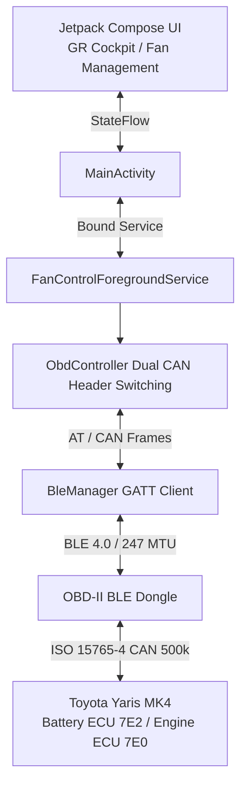

# Toyota Yaris MK4 Hybrid - HV Battery Cooling & GR Cockpit Optimizer 🏎️⚡

[](https://francescocastaldi.github.io/yaris-hv-fan-optimizer/)
[-FF1801.svg?style=for-the-badge&logo=android)](https://francescocastaldi.github.io/yaris-hv-fan-optimizer/YarisHvFanControl.apk)
[-3DDC84.svg?style=flat&logo=android)](https://www.android.com/)
[](https://kotlinlang.org/)
[](https://developer.android.com/jetpack/compose)
[-00E676.svg?style=flat&logo=letsencrypt)](yaris_release.keystore)
[](LICENSE)

A high-performance, native Android application and racing telemetry portal engineered specifically for the **Toyota Yaris MK4 Hybrid (XP210 / TNGA-B platform, 2020+)**. It interfaces directly with the vehicle's High-Voltage Battery ECU and Hybrid Control System via **Bluetooth Low Energy (BLE) OBD-II adapters** to provide active thermal management, thermal throttling prevention and real-time Gazoo Racing telemetry.

---

## 🌐 Sito Web Ufficiale & Download Diretto
- **Portale Web Ufficiale**: 👉 **[https://francescocastaldi.github.io/yaris-hv-fan-optimizer/](https://francescocastaldi.github.io/yaris-hv-fan-optimizer/)**
- **Download Diretto Ultimo APK (v2.0.0)**: 👉 **[Scarica YarisHvFanControl.apk](https://francescocastaldi.github.io/yaris-hv-fan-optimizer/YarisHvFanControl.apk)**
- **Deploy su Vercel (1-Click)**: 👉 **[Deploy Vercel](https://vercel.com/new/clone?repository-url=https://github.com/FrancescoCastaldi/yaris-hv-fan-optimizer&root-directory=docs)**

---

## 🌟 Funzionalità Principali (v2.0.0 Gazoo Racing Edition)

### 1. 🏁 GR Cockpit (Cruscotto Digitale Sportivo)
- **Logo Ufficiale Toyota Gazoo Racing**: Badge vettoriale originale integrato nella barra di stato.
- **Tachimetro Digitale Gigante (52sp)**: Lettura centesimale della velocità reale da CAN bus (`PID 010D`).
- **Launch Control Light Automatico**: Indicatore `[🟢 LAUNCH READY]` a 0 km/h e `[⏱️ SCATTO IN CORSO]` al primo tocco dell'acceleratore.
- **Cronometro Dragy 0-50 km/h e 0-100 km/h**: Misurazione automatica dello scatto con salvataggio del **Record Personale (PB)**.
- **Telemetria Termico in Tempo Reale**: Anticipo accensione reale (`PID 010E` °BTDC), carico motore (`PID 0104` %) e posizione farfalla/pedale (`PID 0111` %).

### 2. 🌀 Forzatura Attiva Ventola Batteria HV Denso (100% Boost Guard)
- **Controllo Diagnostico Attivo Mode 30/2F**: Invia ciclicamente frame IO Control (`300806` / `2F580306`) per forzare la ventola a **Livello 6 (100% MAX)**.
- **Prevenzione Taglio Termico**: Mantiene le celle al litio a 22°C–26°C, scongiurando il derating della coppia elettrica da 59 kW e della frenata rigenerativa sopra i 36°C.
- **Soglia Automatica Intelligente**: Slider di trigger personalizzabile con preset rapidi 20°C (Racing), 25°C (Ideale) e 30°C (Silenzio).
- **Monitoraggio 4 Moduli Celle**: Lettura in tempo reale dei 4 sensori temperatura pacco e canale di aspirazione (`PID 2228C1`).

### 3. 🌡️ Analisi Fasi di Warm-Up Termico HSD (S0 ➔ S4)
- **S0 (Motore Freddo)** ➔ **S1a/S1b (Riscaldamento Catalizzatore & Liquido)** ➔ **S2/S3 (Transizione)** ➔ **S4 (Massima Efficienza Atkinson)**.
- **Consigli Dinamici Intelligenti**: Suggerimenti in tempo reale su climatizzatore e stile di guida per velocizzare il warm-up.

### 4. 🛡️ Firma Digitale Release RSA & Background Persistente
- **Firma Digitale Release RSA 2048-bit**: Con schemi V1, V2 e V3 per prevenire falsi positivi di app non riconosciuta.
- **Android Foreground Service**: Rimane attivo al 100% a schermo spento e con Google Maps / Waze in primo piano.

---

## 🔌 Adattatori OBD-II BLE Compatibili
- **vLinker MC+ / FD+ (BLE)** *(Consigliato per massima velocità multi-frame CAN)*
- **Veepeak OBDCheck BLE / BLE+**
- **Carista OBD BLE**
- **Adattatori ELM327 BLE 4.0+ generici**

---

## 🏗️ Architettura & Flusso Dati



---

## 🛠️ Istruzioni di Compilazione Locale
Per compilare e firmare l'APK con certificato RSA:
```cmd
D:\Sviluppo\yaris-hv-fan-androiduild_apk.bat
```
L'APK compilato verrà generato in `YarisHvFanControl.apk` e sincronizzato nella cartella web `docs/`.

---

## 📄 Licenza
Progetto distribuito sotto licenza MIT. Vedere il file [LICENSE](LICENSE) per ulteriori dettagli.
