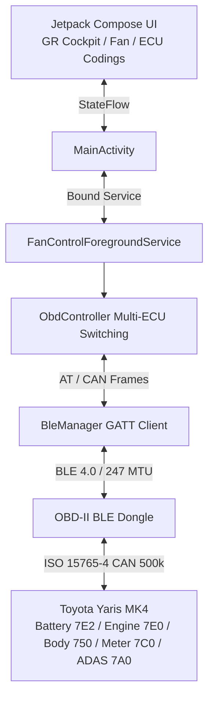

# Toyota Yaris MK4 Hybrid — HV Battery Cooling, GR Cockpit & ECU Coding Suite 🏎️⚡

[](https://francescocastaldi.github.io/yaris-hv-fan-optimizer/)
[-D71920.svg?style=for-the-badge&logo=android)](https://francescocastaldi.github.io/yaris-hv-fan-optimizer/YarisHvFanControl-v3.0.7.apk)
[-00E5FF.svg?style=for-the-badge&logo=android)](https://francescocastaldi.github.io/yaris-hv-fan-optimizer/YarisObdBridge-v1.0.0.apk)
[-3DDC84.svg?style=flat&logo=android)](https://www.android.com/)
[](https://kotlinlang.org/)
[](https://developer.android.com/jetpack/compose)
[](https://github.com/FrancescoCastaldi/yaris-hv-fan-optimizer)
[-00E676.svg?style=flat&logo=letsencrypt)](#)
[](LICENSE)

Native Android telemetry and diagnostic application for the **Toyota Yaris MK4 Hybrid (XP210 / TNGA-B Platform, MY2020–2025+)**. Connects via Bluetooth Low Energy (BLE) or Bluetooth Classic SPP to vehicle CAN infrastructure to deliver:

1. **Intelligent Handshake Protocol (v2.9.6+)**:
   - Proactive `\r\r` wake-up sequence recovering adapters (e.g. Vgate iCar Pro) from low-power standby.
   - Warm Start / Reset (`AT WS` / `AT Z`) with calibrated 600ms settling time without baud rate loss.
   - Robust vehicle READY detection via true 12V bus voltage (`AT RV >= 13.0V`, active DC-DC converter), immune to firmware banner strings, complemented by periodic CAN probe verification.
   - Low-power standby state when vehicle is off or non-READY, eliminating bus flooding, `NO DATA` loops, and 12V auxiliary battery drain.
2. **Denso Multi-Frame ISO-TP Hardware Flow Control (PID 2228C1)**:
   - Dynamic ELM/STN hardware configuration (`AT CRA 7EA`, `AT FC SH 7E2`, `AT FC SD 300000`, `AT FC SM 1`) with calibrated timeout (`AT ST C8`, ~819ms) providing ample headroom for multi-frame cell and fan responses.
3. **Silent Reconnection Watchdog & Instant Auto-Connect**:
   - Closed-loop background watchdog with exponential backoff and thread-safe streaming; non-blocking recovery upon ignition cycles.
   - Seamless auto-pairing to previously bonded Bluetooth adapters without scan modal friction.
4. **Motorsport Carbon Fiber 3K High-Definition Visual Engine**:
   - 2x2 Twill carbon weave scaled for AMOLED displays (36dp / 400+ PPI) with realistic graphite/titanium highlights (`#2A303E` / `#363F50`), midtones (`#161B24`), deep shadow voids (`#080A0E`), and GPU-accelerated radial vignette.
5. **Smart Auto-Cooling Protection Suite**:
   - Predictive thermal regulation with adjustable trigger threshold (28°C–42°C), hysteresis band (1°C–5°C), target fan speed selection (L1–L6), and continuous 24/7 background execution via `ForegroundService` with audible and haptic notifications.
6. **MoTeC / Gazoo Racing Telemetry & Dragy 0–100 km/h Precision Timer**:
   - High-precision linear interpolation for 0–50 km/h and 0–100 km/h acceleration tracking with persistent Personal Best (PB) logging.
7. **Active Denso HV Battery Cooling Fan Control**:
   - UDS IO Control Mode 0x2F / Mode 0x30 direct fan speed control with closed-loop ECU acknowledgment and Hall RPM feedback.
8. **Comprehensive UDS ECU Customization Suite**:
   - Complete on-demand configuration for Toyota Touch 3 display audio, reverse comfort beep, auto-door locking, key-fob window roll, comfort turn signals, and ADAS alerts.
9. **Standalone OBD Bridge & Sniffer Module (`:sniffer`)**:
   - Dedicated MITM proxy utility logging raw bidirectional OBD traffic for Car Scanner and Dr. Prius analysis via local TCP port 35000.

---

## 🌐 Official Web Portal & Downloads

- **Official Web Portal**: [https://francescocastaldi.github.io/yaris-hv-fan-optimizer/](https://francescocastaldi.github.io/yaris-hv-fan-optimizer/)
- **Interactive Web Simulator**: [https://francescocastaldi.github.io/yaris-hv-fan-optimizer/preview.html](https://francescocastaldi.github.io/yaris-hv-fan-optimizer/preview.html)
- **Direct Download — Yaris HV Fan Control (v3.0.7)**: [YarisHvFanControl-v3.0.7.apk](https://francescocastaldi.github.io/yaris-hv-fan-optimizer/YarisHvFanControl-v3.0.7.apk)
- **Direct Download — Yaris OBD Bridge & Sniffer (v1.0.0)**: [YarisObdBridge-v1.0.0.apk](https://francescocastaldi.github.io/yaris-hv-fan-optimizer/YarisObdBridge-v1.0.0.apk)

---

## 🌟 Application Architecture (3-Tab Interface)

### 1. 🏁 `COCKPIT` Tab (Telemetry & Performance)
- **Official Gazoo Racing "GR" Badge**: High-contrast vector badge on OLED dark background.
- **Large Digital Speedometer (52sp)**: Real-time road speed directly from engine CAN bus (`PID 010D`).
- **Automatic Launch Control Indicator**: Transitions from `[🟢 LAUNCH READY]` at standstill to `[⏱️ ACCELERATING]` on first throttle input.
- **Dragy Sprint Timer (0–50 km/h & 0–100 km/h)**: Automatic split-second sprint timing with persistent Personal Best storage.
- **M15A-FXE Engine Telemetry**: Real-time ignition timing advance (`PID 010E` °BTDC), calculated engine load (`PID 0104` %), and throttle position (`PID 0111` %).

### 2. 🌀 `FAN` Tab (Smart Auto-Cooling & Hybrid Safety)
- **Smart Auto-Cooling Protection System**:
  - Continuous slider for trigger threshold (28.0°C–42.0°C in 0.5°C steps).
  - Adjustable hysteresis band (1.0°C–5.0°C) eliminating cycling chatter.
  - Target fan speed selector (Levels 1 through 6) with quick presets (*Gazoo Track*, *Balanced*, *Comfort*).
  - Uninterrupted 24/7 background operation via `ForegroundService` with alert audio and haptic feedback.
- **Denso Fan Manual Override (Level 6 MAX)**: Dispatches UDS IO Control commands (`2F 58 03 06` / `30 08 06`) to instantly evacuate battery pack heat.
- **Thermal Derating Prevention (Zero Power Cut)**: Maintains cells between 22°C and 26°C, averting EV motor derating and regenerative braking throttling above 36°C.
- **4-Probe Cell Monitoring**: Real-time intake temperature and 4-probe module array tracking (`PID 2228C1`).
- **HSD Warm-Up Stage Tracking (S0 ➔ S4)**: Real-time monitoring of catalyst and coolant temperatures for optimal Atkinson EV gliding.

### 3. 🛠️ `CODING` Tab (UDS ECU Customization)
- **Toyota Touch 3 (Display Audio)**:
  - Startup animation selection: Gazoo Racing (GR), Hybrid Synergy Drive, or Toyota Standard.
  - Auto Sound Levelizer (ASL) speed-sensitive volume compensation.
  - Reverse camera shutoff delay (5s or 10s).
  - Touchscreen beep tone & hands-free microphone gain.
- **Comfort & Cabin Sounders**:
  - Reverse alert: Single Beep Comfort or continuous OEM sounder.
  - Seat belt reminder chimes: selective disable for driver, front passenger, and rear row.
- **Smart Key & Central Locking**:
  - Speed-sensing auto-lock at 20 km/h or shift into D.
  - Auto-unlock upon shifting into P.
  - Remote key-fob long-press window open/close.
  - Answerback horn volume feedback.
- **Lighting & Convenience**:
  - One-touch lane-change turn signals (3, 4, 5, or 6 flashes).
  - Twilight sensor sensitivity & Follow-Me-Home headlights (30s, 60s, 90s).
  - Interior cabin lighting timers (7.5s, 15s, 30s) and footwell illumination.
- **ADAS & Climate Control**:
  - Road Sign Assist (RSA) speed-limit alert mode: Visual-only or Audible.
  - Blind Spot Monitor (BSM) sensitivity & Lane Departure Alert (LDA) volume.
  - Air conditioning link with AUTO button & Eco AirCon profile.
- **One-Click Factory Reset**: Dedicated fail-safe restoring all customizable parameters to OEM defaults.

---

## 🧪 Automated Testing & Code Integrity (100% Passing)

The project includes over 90 automated unit and integration tests under `app/src/test/java/com/yaris/hvfan/`:
- `ToyotaCommandsTest.kt` / `Elm327ParserTest.kt`: UDS battery frame decoding, diagnostic constants, protocol sanitation, and response filtering.
- `EcuCodingAndPipelineTest.kt`: Telemetry math, ignition timing advance formulas, load percentages, and ECU defaults.
- `ObdControllerIntegrationTest.kt`: Dragy timing logic, warm-up state machine, and UDS write payloads.
- `ObdStateMachineTest.kt`: Capability state transitions (standby, CAN discovery, battery latching, auto-recovery).
- `ObdInitSequenceTest.kt`: ELM327 initialization sequences, AT command ordering, and clone-safe flow control.
- `BatteryDiscoveryEngineTest.kt` / `ObdControllerBatteryDiscoveryTest.kt`: Candidate fallback chain probing, candidate cooldowns, latching, and failure cycle tracking.
- `EngineTelemetryResilienceTest.kt`: Zero-starvation invariant verifying fast engine telemetry under continuous 3000ms battery discovery timeouts (VAL-OBD-007/012).
- `AdapterErrorHandlingIntegrationTest.kt`: Adapter error resilience exercising persistent `NODATA`, malformed frames, transport drops, negative UDS responses (0x7F), and transient recovery with `batteryAdapterLimitationWarning` assertions.

Execute the test suite locally:
```bash
gradle testDebugUnitTest
```

---

## 🔌 Supported OBD-II BLE Adapters

- **Vgate iCar Pro BLE 4.0+ / iCar 2 BLE** (Full plug-and-play and low-power standby compatibility)
- **vLinker MC+ / FD+ (BLE)** (Recommended for high-speed multi-frame CAN transmission)
- **Veepeak OBDCheck BLE / BLE+**
- **Carista OBD BLE**
- **Standard ELM327 BLE 4.0+ Adapters**

---

## ⚠️ OBD-II Adapter Multi-Frame Compatibility

If app logs display persistent `NODATA` errors on battery temperature queries (`PID 2228C1` and fallback candidates) while speed, RPM, and engine load stream normally, this indicates an **adapter hardware limitation rather than an application defect**.

- **Root Cause**: Querying the Denso HV Battery ECU (`7E2`) requires **ISO-TP multi-frame** handling with flow-control between consecutive CAN frames. Low-cost ELM327 clones frequently lack compliant multi-frame firmware logic. In contrast, queries to engine (`7E0`), body (`750`), meter (`7C0`), and ADAS (`7A0`) are **single-frame** and succeed even on budget hardware.
- **Identification**: When consecutive discovery cycles fail to latch any battery PID while engine telemetry updates smoothly, the adapter is unable to assemble multi-frame responses.
- **Recommended Action**: Use adapters featuring genuine **OBDLink STN chipsets (STN11xx / STN21xx)** or verified **vLinker** hardware for reliable multi-frame ISO-TP decoding.

---

## 🏗️ System Architecture & Data Pipeline



---

## 🕵️ Yaris OBD Bridge & Sniffer (Standalone Module `:sniffer`)

The repository includes **Yaris OBD Bridge**, an independent diagnostic and MITM reverse-engineering utility distributed as a standalone APK:

- **Direct Download**: [YarisObdBridge-v1.0.0.apk](https://francescocastaldi.github.io/yaris-hv-fan-optimizer/YarisObdBridge-v1.0.0.apk)
- **Operational Workflow**:
  1. Connects to OBD-II Bluetooth hardware (Classic SPP or BLE).
  2. Binds a local TCP bridge server listening on `127.0.0.1:35000` (and `0.0.0.0:35000`).
  3. Third-party applications (e.g. **Dr. Prius** or **Car Scanner**) connect via **Wi-Fi / TCP mode** targeting `127.0.0.1:35000`.
  4. Every outbound frame (`TX >>>`) and inbound response (`RX <<<`) is recorded with millisecond-accurate timestamps.
  5. The resulting diagnostic trace file can be shared immediately via system share sheets (Drive, Telegram, Email, WhatsApp).

---

## 🛠️ Local Build & Distribution Pipeline

Compile, test, and RSA-sign both release packages via the validated environment script:
```cmd
build_apk.bat
```

Generated APKs are automatically verified, signed with release keys, and placed in both the project root and `docs/`:
- `YarisHvFanControl-v3.0.7.apk` (Primary application)
- `YarisObdBridge-v1.0.0.apk` (Standalone MITM sniffer & bridge)

---

## 📄 License

This project is licensed under the MIT License. See [LICENSE](LICENSE) for complete terms.
