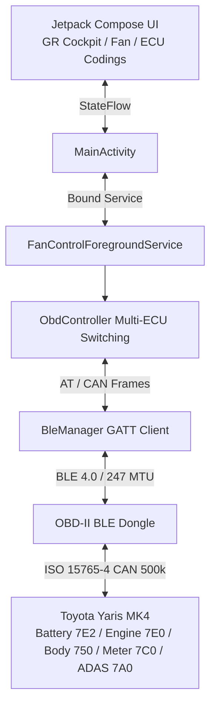

# Toyota Yaris MK4 Hybrid - HV Battery Cooling, GR Cockpit & ECU Coding Suite 🏎️⚡

[](https://francescocastaldi.github.io/yaris-hv-fan-optimizer/)
[-FF1801.svg?style=for-the-badge&logo=android)](https://francescocastaldi.github.io/yaris-hv-fan-optimizer/YarisHvFanControl.apk)
[-3DDC84.svg?style=flat&logo=android)](https://www.android.com/)
[](https://kotlinlang.org/)
[](https://developer.android.com/jetpack/compose)
[](https://github.com/FrancescoCastaldi/yaris-hv-fan-optimizer)
[-00E676.svg?style=flat&logo=letsencrypt)](yaris_release.keystore)
[](LICENSE)

Applicazione Android nativa ad altissime prestazioni per **Toyota Yaris MK4 Hybrid (Piattaforma XP210 / TNGA-B, MY2020 - MY2025+)**. Interagisce via Bluetooth Low Energy (BLE) con l'infrastruttura CAN bus dell'auto per offrire:
1. **Telemetria Gazoo Racing & Cronometro Dragy 0-100 km/h**;
2. **Gestione Termica Attiva & Forzatura Ventola Batteria HV Denso** (100% Boost elettrico costante);
3. **Suite Completa di Codifiche Centralina ECU UDS** (Toyota Touch 3, Bip retromarcia comfort, Chiusura porte, Alzacristalli da chiave, Frecce comfort e ADAS).

---

## 🌐 Sito Web Ufficiale & Download Diretto
- **Portale Web Ufficiale**: 👉 **[https://francescocastaldi.github.io/yaris-hv-fan-optimizer/](https://francescocastaldi.github.io/yaris-hv-fan-optimizer/)**
- **Download Diretto Ultimo APK (v2.4.0)**: 👉 **[Scarica YarisHvFanControl.apk](https://francescocastaldi.github.io/yaris-hv-fan-optimizer/YarisHvFanControl.apk)**
- **Deploy su Vercel (1-Click)**: 👉 **[Deploy Vercel](https://vercel.com/new/clone?repository-url=https://github.com/FrancescoCastaldi/yaris-hv-fan-optimizer&root-directory=docs)**

---

## 🌟 Architettura a 3 Schede (Release v2.4.0 Gazoo Racing Edition)

### 1. 🏁 Scheda `COCKPIT` (Telemetria & Prestazioni)
- **Logo Ufficiale Toyota Gazoo Racing "GR"**: Badge vettoriale originale ad alto contrasto con contorni bianchi nitidi su sfondo Dark/OLED.
- **Tachimetro Digitale Gigante (52sp)**: Lettura in tempo reale della velocità reale da CAN bus (`PID 010D`).
- **Launch Control Light Automatico**: Indicatore `[🟢 LAUNCH READY]` a 0 km/h e `[⏱️ SCATTO IN CORSO]` al primo tocco dell'acceleratore.
- **Cronometro Dragy 0-50 km/h e 0-100 km/h**: Misurazione automatica dello scatto con memorizzazione persistente del **Personal Best (PB)**.
- **Telemetria Motore Termico M15A-FXE**: Anticipo di accensione reale (`PID 010E` °BTDC), carico motore (`PID 0104` %) e posizione farfalla (`PID 0111` %).

### 2. 🌀 Scheda `VENTOLA` (Termica & Sicurezza Ibrida)
- **Forzatura Attiva Ventola Denso (Livello 6 MAX)**: Invia frame UDS IO Control Mode 30 (`300806`) per raffreddare istantaneamente il pacco batteria.
- **Prevenzione Tagli Termici (Zero Derating)**: Mantiene le celle tra 22°C e 26°C, scongiurando il taglio di coppia da 59 kW e della frenata rigenerativa sopra i 36°C.
- **Monitoraggio 4 Sonde Celle**: Lettura in tempo reale di tutte le temperature del pacco e della temperatura di aspirazione (`PID 2228C1`).
- **Analisi Fasi Warm-Up (S0 ➔ S4)**: Tracciamento delle fasi di riscaldamento del catalizzatore e del liquido refrigerante per la massima efficienza in modalità EV.

### 3. 🛠️ Scheda `CODIFICHE` (Personalizzazioni Centralina UDS)
- **📺 Toyota Touch 3 (Display Audio)**:
  - *Animazione di Avvio Schermo*: Impostabile su **🏁 Toyota Gazoo Racing (GR)**, **⚡ Hybrid Synergy Drive** o **Toyota Standard**.
  - *Auto Sound Levelizer (ASL)*: Compensazione automatica del volume in base alla velocità.
  - *Ritardo Spegnimento Retrocamera in D*: 5s o 10s per manovre comode.
  - *Bip Touchscreen & Guadagno Microfono Viva Voce*.
- **🔔 Comfort & Cicalini di Bordo**:
  - *Cicalino Retromarcia*: **Singolo Bip (One Beep Comfort)** o Bip Continuo OEM.
  - *Cicalini Cinture di Sicurezza*: Disattivazione/Attivazione selettiva guidatore, passeggero e sedili posteriori.
- **🔑 Smart Key & Serrature**:
  - *Chiusura Automatica Porte*: A 20 km/h (Speed Lock) o all'inserimento della marcia D.
  - *Sblocco Automatico*: All'inserimento della marcia P.
  - *Apertura/Chiusura Finestrini da Telecomando* (Pressione prolungata).
  - *Volume Sirena Esterna Answerback*: Feedback acustico di chiusura e apertura porte.
- **💡 Luci, Frecce & Plafoniera**:
  - *Frecce Comfort al Tocco (Lane Change)*: 3, 4, 5 o 6 lampeggi automatici.
  - *Sensibilità Fari Crepuscolari & Follow Me Home*: 30s, 60s, 90s.
  - *Temporizzazione Luce Abitacolo*: 7.5s, 15s, 30s e illuminazione vano piedi in marcia.
- **🛡️ ADAS & Clima**:
  - *Bip Limiti di Velocità RSA*: Muto (solo visivo) o sonoro.
  - *Sensibilità Angolo Cieco (BSM) & Volume Avviso Corsia (LDA)*.
  - *Funzionamento A/C con Tasto AUTO* & Modalità Eco AirCon.
- **🔄 Sicurezza & Ripristino Fabbrica**: Pulsante dedicato per ripristinare tutte le impostazioni OEM di fabbrica a 1-click.

---

## 🧪 Test Automatizzati & Qualità del Codice (100% Passing)
La pipeline di build integra test unitari e di integrazione continui:
- `ToyotaCommandsTest.kt`: Test parsing frame UDS batteria e costanti diagnostiche;
- `Elm327ParserTest.kt`: Test pulizia protocollo e filtraggio risposte;
- `EcuCodingAndPipelineTest.kt`: Test formule telemetria, formule °BTDC, percentuali carico e default ECU;
- `ObdControllerIntegrationTest.kt`: Test logica cronometro Dragy, macchina a stati warm-up e payload di scrittura UDS Mode 3B/2E.

Esegui i test localmente con:
```bash
gradle testReleaseUnitTest
```

---

## 🔌 Adattatori OBD-II BLE Compatibili
- **vLinker MC+ / FD+ (BLE)** *(Consigliato per massima velocità multi-frame CAN)*
- **Veepeak OBDCheck BLE / BLE+**
- **Carista OBD BLE**
- **Adattatori ELM327 BLE 4.0+ generici**

---

## 🏗️ Architettura & Flusso Dati



---

## 🛠️ Compilazione e Rilascio Locale
Per compilare e firmare l'APK con certificato RSA:
```cmd
D:\Sviluppo\yaris-hv-fan-android\build_apk.bat
```
L'APK generato viene automaticamente copiato e verificato in `YarisHvFanControl.apk` e sincronizzato nella cartella web `docs/`.

---

## 📄 Licenza
Progetto distribuito sotto licenza MIT. Vedere il file [LICENSE](LICENSE) per ulteriori dettagli.
